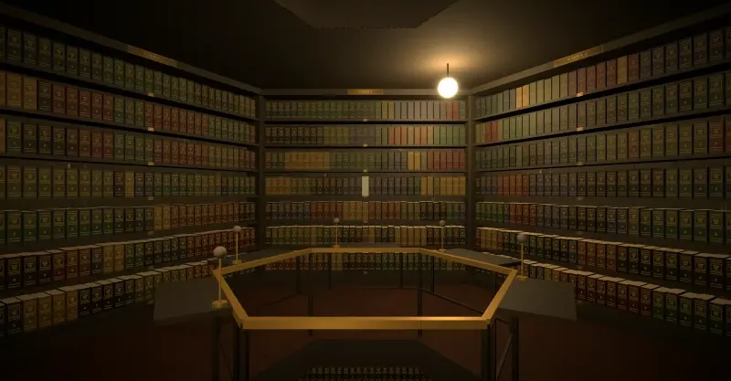

<p align="center">
  
  
  
  
  
</p>

<p align="center">
  <a href="README.md">Русский</a> &nbsp;·&nbsp; <b>English</b>
</p>

<h1 align="center">
  <br>
  The Library of Babel
  <br>
  <sub>La Biblioteca de Babel</sub>
</h1>

<p align="center">
  <em>&ldquo;The universe, which some call the Library, is made of hexagonal galleries.&rdquo;</em>
  <br>
  <sub>&mdash; after Jorge Luis Borges, 1941</sub>
</p>

<p align="center">
  
</p>

---

A digital incarnation of the legendary library from Borges' short story. The Library holds **every possible book** &mdash; every combination of characters that can ever be written. Every page you will ever read or write already exists here. Every word, every thought, every story is already on a shelf, waiting to be found.

And you can **walk through it**. Hexagonal galleries, spiral staircases, endless shelves &mdash; in first person, like a game: take any volume off a shelf, open it on a reading table and turn its pages.

The Library speaks **two languages**. The `RU | EN` switch in the header changes more than the interface: it changes the Library itself. In English its books are written in Latin letters, so you can search it for English text.

## A walk

The galleries never end. Beyond the door is a vestibule with a spiral staircase, beyond that the next gallery, and above and below there are more galleries still. Everything nearby is already loaded and drawn, so crossing from one gallery into the next gives nothing away: the world simply goes on.

At the shaft railing, opposite each of the five walls of shelves, stands a reading desk with a brass lamp &mdash; a volume taken from that wall comes to rest on it.

<p align="center">
  
</p>

<table>
  <tr>
    <td width="50%">
      
      <br><sub><b>A hexagonal gallery.</b> Five walls of shelves, a lamp overhead and reading desks at the railing of the shaft.</sub>
    </td>
    <td width="50%">
      
      <br><sub><b>Like a shooter.</b> The mouse steers your gaze, the crosshair pulls a volume out, a click sends it to a desk.</sub>
    </td>
  </tr>
  <tr>
    <td width="50%">
      
      <br><sub><b>The vestibule.</b> The spiral staircase leads to the floors above and below, the door to the next gallery.</sub>
    </td>
    <td width="50%">
      
      <br><sub><b>The shaft.</b> The desks stand in a ring at the railing, and past it you can see the gallery below &mdash; and the one below that.</sub>
    </td>
  </tr>
</table>

## Books

Click a volume and it slides off the shelf, flies across the gallery and settles onto the desk at the railing, opening to its title page and index. The back link &mdash; in the header, or the browser's own &mdash; closes the book and sends it home to its gap on the shelf, and your view returns to right where you stood. A flight can be skipped with a click, Space, Enter or Esc, and reversed just as easily if you change your mind partway through.

<p align="center">
  
</p>

Every shelf holds 31 volumes with a title on the spine; every volume has 421 pages. An open book reads like a real one: turn the pages, lean over a page and run your eye along the lines, search the spread for a phrase. Turn quickly and the pages fan out, several in the air at once, and no two leaves turn alike.

<p align="center">
  
</p>

<table>
  <tr>
    <td width="50%">
      
      <br><sub><b>Fanning out.</b> Turn quickly and several pages are in the air at once.</sub>
    </td>
    <td width="50%">
      
      <br><sub><b>Over the page.</b> The wheel flies to the spot under the cursor; the mouse and <code>W A S D</code> carry your eye along the lines.</sub>
    </td>
  </tr>
</table>

For a closer look there is a loupe: the &ldquo;loupe&rdquo; button, the `L` key or a click of the mouse wheel. It follows the cursor and magnifies whatever lies under it &mdash; the letters, the ribbon, the lamp, the table &mdash; and the wheel changes its power from ×1.5 to ×6. `Esc` puts it away.

<p align="center">
  
</p>

<table>
  <tr>
    <td width="50%">
      
      <br><sub><b>A shelf up close.</b> The open shelf is lit, and every volume has a title of its own.</sub>
    </td>
    <td width="50%">
      
      <br><sub><b>An open volume.</b> The title page and an index of all 421 pages, on the desk at the railing.</sub>
    </td>
  </tr>
  <tr>
    <td width="50%">
      
      <br><sub><b>The reading desk.</b> A spread under the desk lamp, with a red ribbon, and the same gallery all around.</sub>
    </td>
    <td width="50%">
      
      <br><sub><b>Search on the page.</b> The phrase &ldquo;the library of babel&rdquo; turned up on page 105, and the camera glides over to it.</sub>
    </td>
  </tr>
</table>

## How the Library is laid out

Just as Borges described it:

```
  gallery        wall        shelf        volume        page
 ┌─────────┐   ┌───────┐   ┌───────┐   ┌────────┐   ┌─────────┐
 │ address │ → │ 1 — 5 │ → │ 1 — 7 │ → │ 1 — 31 │ → │ 1 — 421 │
 └─────────┘   └───────┘   └───────┘   └────────┘   └─────────┘

  every page holds 4,819 characters of a 98-symbol alphabet:
  52 Latin letters of both cases, 10 digits, the space,
  the line break and 34 marks: all of printable ASCII and — …
```

The English Library has 98<sup>4819</sup> ≈ 5.2 × 10<sup>9595</sup> distinct pages. Borges' alphabet was more modest: 22 letters, the space, the comma and the full stop. Ours has everything links, keys and code are written with, so you can find a proxy key or a JavaScript function in it, capitals, indentation, line breaks and all.

A gallery address is a string of digits and Latin letters in both cases (62 "digits"). Every address leads to a gallery of its own, and that gallery always holds the same books. The galleries and shelves in the screenshots above come from the gallery at address `babel`.

## Two languages, two Libraries

<p align="center">
  
</p>

The `RU | EN` switch on the right of the header translates the whole site: the menu, the hints and the lettering inside the 3D scenes &mdash; the plaques on the walls, a book's title page and its index of pages. The current page, the gallery address and the phrase you searched for survive the switch.

| | Russian Library | English Library |
|---|---|---|
| URLs | `/`, `/page/…`, `/explore/…` | `/en`, `/en/page/…`, `/en/explore/…` |
| Letters | 33 Russian and 26 Latin, lower and upper case | 26 Latin, lower and upper case |
| Digits, spacing | 10, the space and the line break | 10, the space and the line break |
| Marks | all of printable ASCII and `— … « »` | all of printable ASCII and `— …` |
| Symbols in all | 166 | 98 |
| Distinct pages | 166<sup>4819</sup> ≈ 5.0 × 10<sup>10698</sup> | 98<sup>4819</sup> ≈ 5.2 × 10<sup>9595</sup> |

The same address holds different text in the two Libraries, so the language is part of the link: a link to an English page opens the English page even for someone who has chosen Russian. Your choice is remembered and used on the home page; on the very first visit the home page follows your browser's language.

## Features

**Text search** &mdash; type any text and the Library finds the page it is written on. Your text already exists; you only need to know where to look.

**Exact search** &mdash; find a page filled with your text and nothing else.

**Title search** &mdash; every volume has a title. Find a book by its title.

**Browse** &mdash; pick the coordinates yourself: wall, shelf, volume and page &mdash; and look into a random book at that spot.

**Random page** &mdash; let the Library pick a page out of infinity for you.

**3D walk** &mdash; an endless first-person world of galleries: shelves with titled spines, a volume that flies to a desk and opens there, and a reader with page turning &mdash; all without a single change of scene.

**Copy and share a fragment** &mdash; the &ldquo;text & address&rdquo; panel beside the open book shows the text of the spread: copy a whole page with one button, or select a few lines and copy a link to them. The link opens the same spread with the panel already open and the fragment marked, both in the text and on the page of the 3D book, and the camera glides over to it. While you select, the book marks the same characters. The mark can take any colour: the swatch next to &ldquo;fragment&rdquo; opens a colour picker with ready-made colours, and your choice is remembered in the browser.

The search box takes several lines: `Enter` searches, `Shift+Enter` starts a new line, and you can paste a poem or a piece of code. Case, spaces and line breaks are kept as they are, a tab becomes four spaces, typographic variants are brought into the alphabet (`“ ”` → `"`, `–` → `—`), and symbols the Library does not have (emoji, say) are dropped. The search box shows in advance what will actually be searched for.

The Library is not a safe: a page's address is its text, written reversibly by an open algorithm. Whoever has the link can read the key that lies on the page.

## Controls

| Where | To | Do |
|-------|----|----|
| Search on the home page | search / new line in the query | `Enter` / `Shift+Enter` |
| Gallery | take the mouse (crosshair in the centre) | click the scene |
| | release the cursor | `Esc` |
| | walk / run / jump | `W A S D` or arrow keys / `Shift` / space |
| | zoom | mouse wheel |
| | open a shelf or a volume | click whatever is under the crosshair |
| Shelf | open a volume | click its spine |
| Volume | open a page | click its number in the index |
| Gallery, shelf, volume, reader | skip a flight | click the scene, space, `Enter` or `Esc` |
| Reader | turn pages | `←` `→`, `PageUp` `PageDown` or click a page |
| | move over the book | drag with the mouse or `W A S D` (`Shift` to hurry) |
| | fly to a spot on the page | mouse wheel towards the cursor, `↑` `↓` closer and farther |
| | tilt the book / see the whole book | right mouse button / `Home` |
| | take the loupe / put it away | the &ldquo;loupe&rdquo; button, `L` or a click of the mouse wheel / `Esc` |
| | change the loupe's power | mouse wheel while the loupe is in hand |
| | find on the spread | the &ldquo;find on the page&rdquo; box |
| | next / previous match | `Enter` / `Shift+Enter` or the `↓` `↑` arrows by the counter |
| | copy a page / share a fragment | &ldquo;text & address&rdquo;, then &ldquo;copy text&rdquo; / select text and &ldquo;link to fragment&rdquo; |
| | change the highlight colour | the colour swatch in the fragment bar |
| Phone | look around / walk | one finger / two fingers |
| | in the reader: move over the book / zoom and tilt | one finger / two fingers |
| Anywhere | change the language | the `RU \| EN` switch in the header |

Where the browser allows pointer lock, it is used. Where it does not, such as embedded preview panes and sandboxes, the cursor is hidden, the free mouse steers the view, and it keeps turning while the cursor rests at the edge of the screen.

## Getting started

```bash
npm install   # dependencies
npm run dev   # development server
```

Open `http://localhost:3000/en`, or go straight to the gallery from the screenshots: `http://localhost:3000/en/explore/wall/1?hex=babel`.

```bash
npm run build && npm start   # production build
npm run lint                 # eslint (flat config)
npm run typecheck            # tsc --noEmit
npm test                     # tests (Vitest)
```

## Under the hood

- **An endless world.** Two galleries share one vestibule, the pairs repeat floor after floor, and the spiral staircase makes one full turn per floor. The neighbouring galleries (through the door, above and below) stay in the scene with their own materials, while distant floors are lightweight copies. The number of lights never changes, so no shader is recompiled as you walk on.
- **One scene for all of it.** The gallery, the shelf up close, the open volume and the reader are not four pages but four states of one scene: the canvas lives in a shared route layout, and a director plays the flights between the states along timelines computed in advance (`src/components/explore/stage`). That is why the book really does fly from the shelf to the desk instead of being replaced by another screen &mdash; and every state is still a plain link you can open directly, while going back mid-flight turns the flight around from wherever it had got to.
- **Determinism.** The addresses of neighbouring galleries are derived from the starting one, so the way back leads to the same books. A gallery's look &mdash; floor, walls, ceiling, shelf wood, leather and binding colours &mdash; is picked from its address too.
- **A reversible algorithm.** Every character of a page is shifted by a pseudo-random keystream seeded from the wall, shelf, volume and page, and the shifted characters are written as address "digits" in blocks: 4 characters of the Russian Library as 5 digits, 7 characters of the English one as 8. A block is read as one number, so a page address takes at most 6,024 characters, only 1% over the theoretical minimum for 62 digits. Search writes a text into an address, reading brings it back (`src/lib/babel.ts`; the packing is in `src/lib/library.ts`, the alphabets in `src/lib/alphabet.ts`).
- **Long links.** An address plus the search phrase `q` can run to tens of kilobytes, and Node rejects requests with headers over 16 KB by default (error 431). `.npmrc` raises that limit for `npm run dev` and `npm start`.
- **Line breaks on the 3D page.** A line ends where the text breaks and wraps after 80 characters. When that makes more than 61 lines, the type gets smaller and the lines longer, just enough for the whole text to fit the leaf (`layoutPage` in `src/components/explore/bookPages.ts`).
- **Internationalization** with [next-intl](https://next-intl.dev): translations in `messages/ru.json` and `messages/en.json`, routes under a `[locale]` segment, Russian without a prefix. `src/proxy.ts` detects the language on the home page only; every other link is never redirected to another language.
- **Textures** (`public/textures`) were generated locally in ComfyUI with the Z-Image Turbo model.
- **The reader** draws pages onto canvas textures ahead of time, a few spreads either way, and uploads them to the GPU at once, so a turning leaf already has text on its back. Every leaf moves on its own (`src/components/explore/leaves.ts`): the next one lifts once the one before is a little ahead, and a long queue is flipped as a bunch. The bend is computed in the vertices of the geometry as a spring, and every turn draws a character of its own (speed, stiffness, which corner leads, the ripple along the edge).
- **The loupe** (`src/components/explore/loupe`) does not stretch the finished frame; it draws the scene once more: the same camera, its view cropped (`setViewOffset`) to a square N times smaller than the lens, and that picture is laid over the glass. So the letters under the loupe stay sharp for as long as the page texture has the resolution. The glass shader squeezes the picture towards the rim, parts the colours a little by the frame and adds highlights. The loupe fits any 3D scene: `<Loupe active />` inside the `Canvas` and the `useLoupe()` hook on the page. The model is [Magnifying Glass 01](https://polyhaven.com/a/magnifying_glass_01) by Nazar Borodavka, Poly Haven (CC0).
- **Links to fragments** look like `/page/<address>?text=12:160-240`: the page, then character offsets into its 4,819-character text (the end exclusive), next to the search phrase `q` if there is one. A selection in the panel is turned into these offsets by measuring the text from the start of the page up to each end of the selection, so search highlights splitting the text into pieces do not get in the way (`src/lib/fragment.ts`).
- **Debug hooks.** In development, `window.__reader` lets you inspect the book's leaves, its page-texture cache and the view, and slow page turns down; `window.__stage` adds `setTimeScale(scale)` to slow or freeze a flight; `seek(fraction)` to jump to a given fraction of it, from 0 to 1; `skip()` to finish it at once; `state()` for the stage's controller and, while a flight plays, its kind and how many seconds through it is; `hide(wall, shelf, volume)` to make one volume vanish from its shelf as if it had been taken; and `lightDesk(wall)` to light that wall's desk lamp by hand, even with no book on it (`null` turns it off).

## Stack

| Layer | Technology |
|-------|------------|
| Framework | **Next.js 16** (App Router, Turbopack) |
| Language | **TypeScript 6** |
| UI | **Chakra UI v3** |
| Animation | **Motion 13** (`motion/react`) |
| 3D | **three.js**, **@react-three/fiber**, **drei**, **postprocessing** |
| Translations | **next-intl 4** |
| Fonts | Cormorant Garamond, JetBrains Mono |

## Philosophy

In Borges' story, the first reaction to the news that the Library holds every book is unbounded joy: somewhere on its shelves lies the answer to every question, personal or universal.

This project is an attempt to touch infinity through a finite screen. Every address is a unique point in the space of all possible texts. The Library does not generate text &mdash; it *finds* it. Pages are not created &mdash; they have always been there.

---

<p align="center">
  <sub>Inspired by Jorge Luis Borges&rsquo; short story &ldquo;The Library of Babel&rdquo; (1941)</sub>
  <br>
  <sub>Made by <a href="https://github.com/HuHguZ">HuHguZ</a> &nbsp;·&nbsp; <a href="README.md">Читать по-русски</a></sub>
</p>
