<p align="center">
  
  
  
  
  
</p>

<p align="center">
  <a href="README.md">Русский</a> &nbsp;·&nbsp; <b>English</b>
</p>

<h1 align="center">
  <br>
  The Library of Babel
  <br>
  <sub>La Biblioteca de Babel</sub>
</h1>

<p align="center">
  <em>&ldquo;The universe, which some call the Library, is made of hexagonal galleries.&rdquo;</em>
  <br>
  <sub>&mdash; after Jorge Luis Borges, 1941</sub>
</p>

<p align="center">
  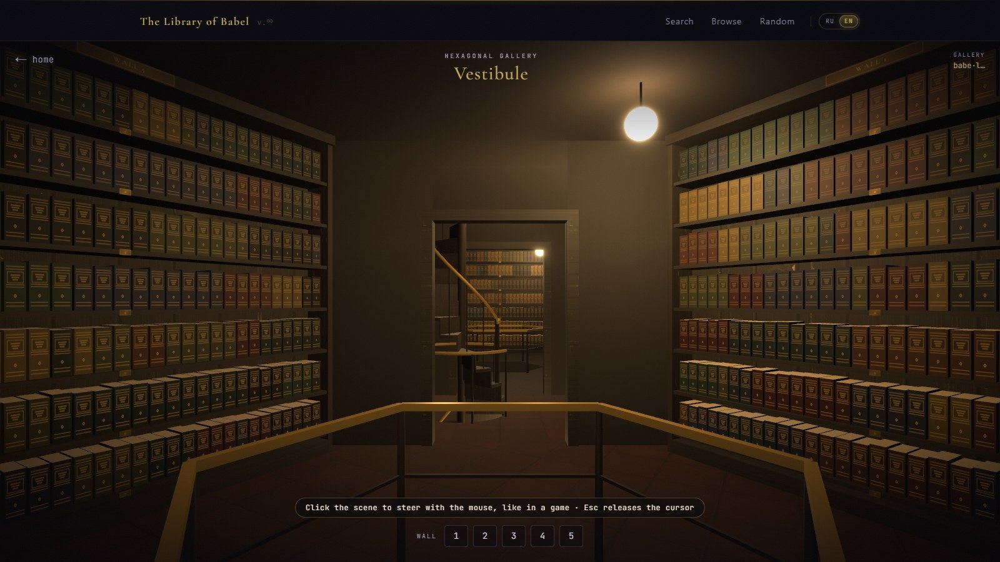
</p>

---

A digital incarnation of the legendary library from Borges' short story. The Library holds **every possible book** &mdash; every combination of characters that can ever be written. Every page you will ever read or write already exists here. Every word, every thought, every story is already on a shelf, waiting to be found.

And you can **walk through it**. Hexagonal galleries, spiral staircases, endless shelves &mdash; in first person, like a game: take any volume off a shelf, open it on a reading table and turn its pages.

The Library speaks **two languages**. The `RU | EN` switch in the header changes more than the interface: it changes the Library itself. In English its books are written in Latin letters, so you can search it for English text.

## A walk

The galleries never end. Beyond the door is a vestibule with a spiral staircase, beyond that the next gallery, and above and below there are more galleries still. Everything nearby is already loaded and drawn, so crossing from one gallery into the next gives nothing away: the world simply goes on.

<p align="center">
  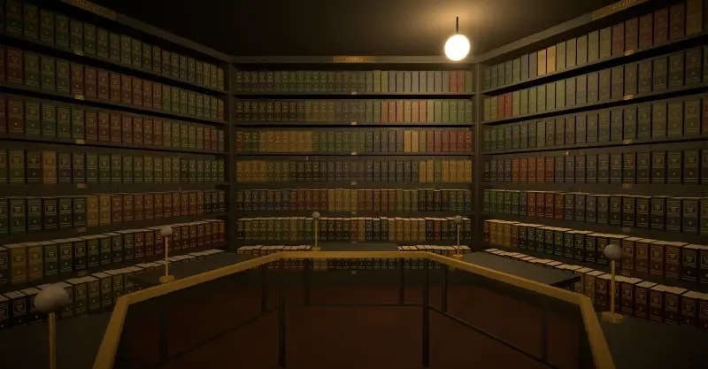
</p>

<table>
  <tr>
    <td width="50%">
      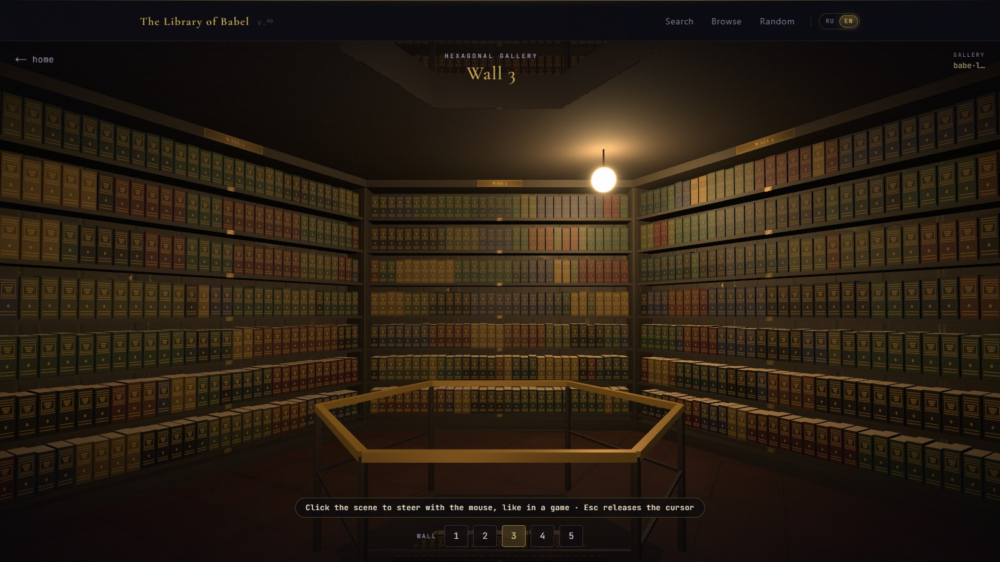
      <br><sub><b>A hexagonal gallery.</b> Five walls of shelves, a lamp and the railing around the shaft.</sub>
    </td>
    <td width="50%">
      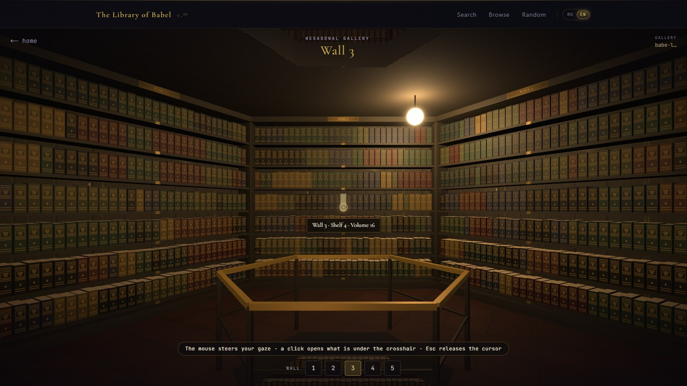
      <br><sub><b>Like a shooter.</b> The mouse steers your gaze, the crosshair pulls a volume out, a click opens it.</sub>
    </td>
  </tr>
  <tr>
    <td width="50%">
      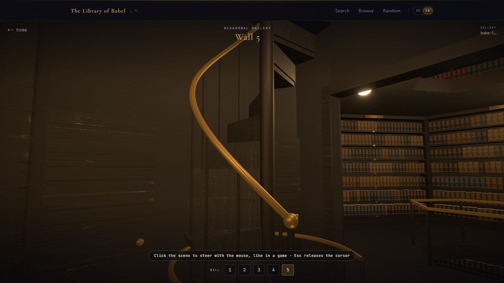
      <br><sub><b>The vestibule.</b> The spiral staircase leads to the floors above and below, the door to the next gallery.</sub>
    </td>
    <td width="50%">
      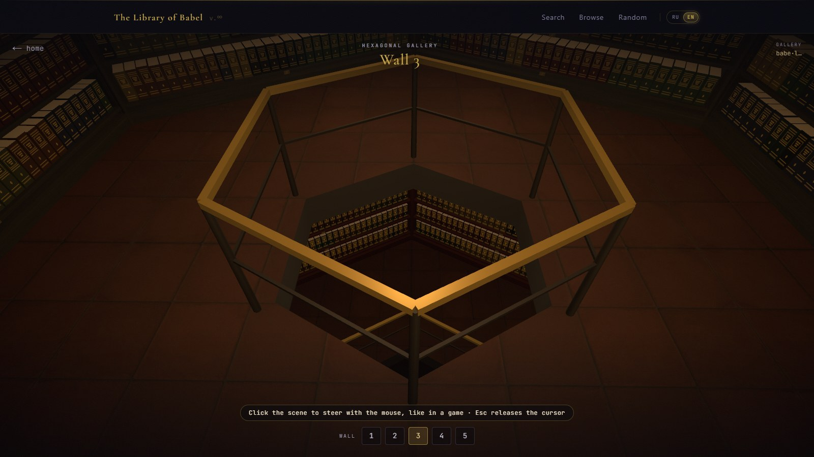
      <br><sub><b>The shaft.</b> Past the railing you can see the gallery below &mdash; and the one below that.</sub>
    </td>
  </tr>
</table>

## Books

Every shelf holds 31 volumes with a title on the spine; every volume has 421 pages. An open book reads like a real one: turn the pages, lean in, search the spread for a phrase.

<p align="center">
  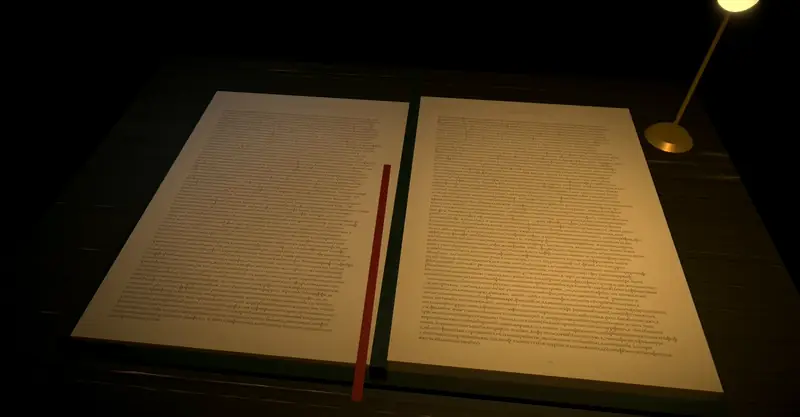
</p>

<table>
  <tr>
    <td width="50%">
      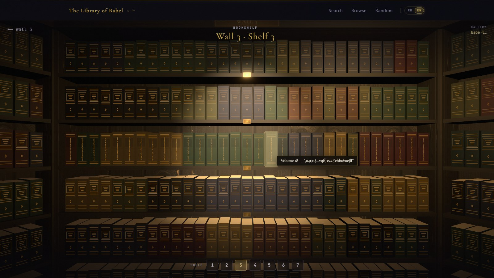
      <br><sub><b>A shelf up close.</b> The open shelf is lit, and every volume has a title of its own.</sub>
    </td>
    <td width="50%">
      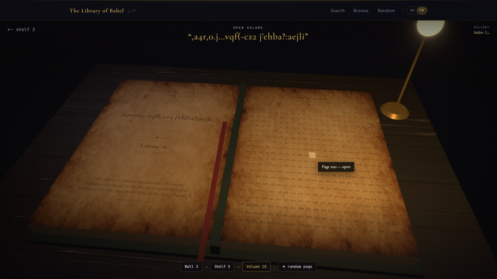
      <br><sub><b>An open volume.</b> The title page and an index of all 421 pages.</sub>
    </td>
  </tr>
  <tr>
    <td width="50%">
      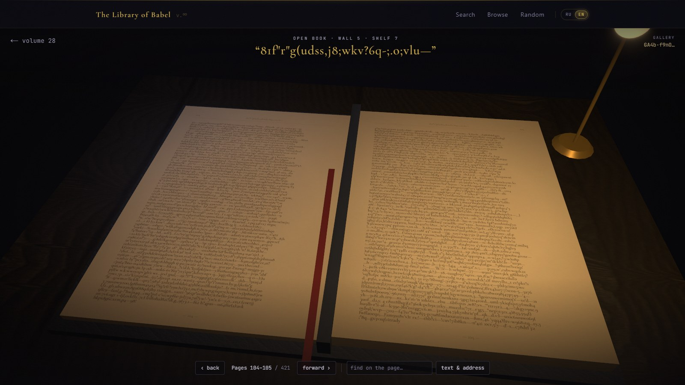
      <br><sub><b>The reading table.</b> A spread under the desk lamp, with a red ribbon.</sub>
    </td>
    <td width="50%">
      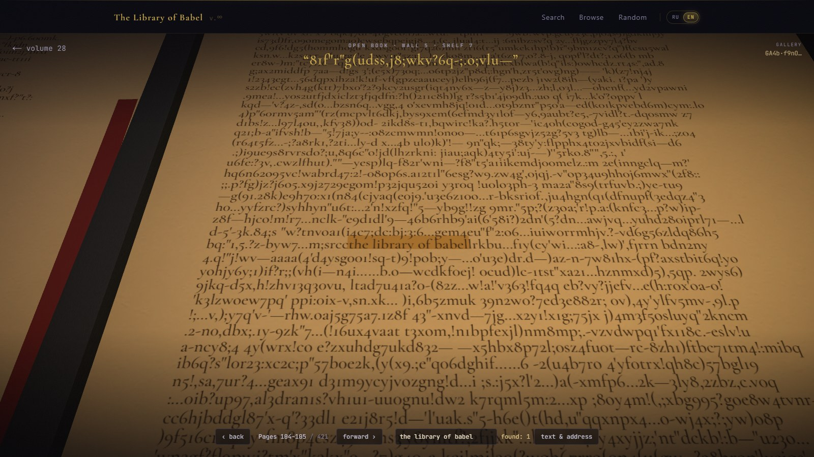
      <br><sub><b>Search on the page.</b> The phrase &ldquo;the library of babel&rdquo; turned up on page 105, and the camera glides over to it.</sub>
    </td>
  </tr>
</table>

## How the Library is laid out

Just as Borges described it:

```
  gallery        wall        shelf        volume        page
 ┌─────────┐   ┌───────┐   ┌───────┐   ┌────────┐   ┌─────────┐
 │ address │ → │ 1 — 5 │ → │ 1 — 7 │ → │ 1 — 31 │ → │ 1 — 421 │
 └─────────┘   └───────┘   └───────┘   └────────┘   └─────────┘

  every page holds 4,819 characters of a 50-symbol alphabet:
  26 lowercase Latin letters, 10 digits, the space
  and 13 punctuation marks  . , ! ? : ; - — … ( ) " '
```

The English Library has 50<sup>4819</sup> ≈ 2.2 × 10<sup>8187</sup> distinct pages. Borges' alphabet was more modest: 22 letters, the space, the comma and the full stop.

A gallery address is a string of digits and Latin letters in both cases (62 "digits", one for every character of a page). Every address leads to a gallery of its own, and that gallery always holds the same books. The galleries and shelves in the screenshots above come from the gallery at address `babel`.

## Two languages, two Libraries

<p align="center">
  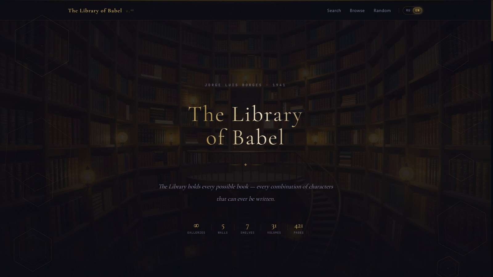
</p>

The `RU | EN` switch on the right of the header translates the whole site: the menu, the hints and the lettering inside the 3D scenes &mdash; the plaques on the walls, a book's title page and its index of pages. The current page, the gallery address and the phrase you searched for survive the switch.

| | Russian Library | English Library |
|---|---|---|
| URLs | `/`, `/page/…`, `/explore/…` | `/en`, `/en/page/…`, `/en/explore/…` |
| Letters | 33 lowercase Russian | 26 lowercase Latin |
| Digits, space | 10 and the space | 10 and the space |
| Punctuation | `. , ! ? : ; - — … ( ) « » " '` | `. , ! ? : ; - — … ( ) " '` |
| Symbols in all | 59 | 50 |
| Distinct pages | 59<sup>4819</sup> ≈ 5.4 × 10<sup>8533</sup> | 50<sup>4819</sup> ≈ 2.2 × 10<sup>8187</sup> |

The same address holds different text in the two Libraries, so the language is part of the link: a link to an English page opens the English page even for someone who has chosen Russian. Your choice is remembered and used on the home page; on the very first visit the home page follows your browser's language.

## Features

**Text search** &mdash; type any text and the Library finds the page it is written on. Your text already exists; you only need to know where to look.

**Exact search** &mdash; find a page filled with your text and nothing else.

**Title search** &mdash; every volume has a title. Find a book by its title.

**Browse** &mdash; pick the coordinates yourself: wall, shelf, volume and page &mdash; and look into a random book at that spot.

**Random page** &mdash; let the Library pick a page out of infinity for you.

**3D walk** &mdash; an endless first-person world of galleries, shelves with titled spines, open volumes and a reader with page turning.

You can search for whole sentences with punctuation and numbers. Capital letters become lowercase, typographic variants are brought into the alphabet (`“ ”` → `"`, `–` → `—`), and symbols the Library does not have are dropped. The search box shows in advance what will actually be searched for.

## Controls

| Where | To | Do |
|-------|----|----|
| Gallery | take the mouse (crosshair in the centre) | click the scene |
| | release the cursor | `Esc` |
| | walk / run / jump | `W A S D` or arrow keys / `Shift` / space |
| | zoom | mouse wheel |
| | open a shelf or a volume | click whatever is under the crosshair |
| Shelf | open a volume | click its spine |
| Volume | open a page | click its number in the index |
| Reader | turn pages | `←` `→`, `PageUp` `PageDown` or click a page |
| | find on the spread | the &ldquo;find on the page&rdquo; box |
| Phone | look around / walk | one finger / two fingers |
| Anywhere | change the language | the `RU \| EN` switch in the header |

Where the browser allows pointer lock, it is used. Where it does not, such as embedded preview panes and sandboxes, the cursor is hidden, the free mouse steers the view, and it keeps turning while the cursor rests at the edge of the screen.

## Getting started

```bash
npm install   # dependencies
npm run dev   # development server
```

Open `http://localhost:3000/en`, or go straight to the gallery from the screenshots: `http://localhost:3000/en/explore/wall/1?hex=babel`.

```bash
npm run build && npm start   # production build
npm run lint                 # eslint (flat config)
npm run typecheck            # tsc --noEmit
```

## Under the hood

- **An endless world.** Two galleries share one vestibule, the pairs repeat floor after floor, and the spiral staircase makes one full turn per floor. The neighbouring galleries (through the door, above and below) stay in the scene with their own materials, while distant floors are lightweight copies. The number of lights never changes, so no shader is recompiled as you walk on.
- **Determinism.** The addresses of neighbouring galleries are derived from the starting one, so the way back leads to the same books. A gallery's look &mdash; floor, walls, ceiling, shelf wood, leather and binding colours &mdash; is picked from its address too.
- **A reversible algorithm.** Every character of a page is one "digit" of the address, shifted by a pseudo-random keystream seeded from the wall, shelf, volume and page. Shifts are taken modulo the size of the alphabet, so one address scheme serves both the 59-symbol Russian and the 50-symbol English Library: search writes a text into an address, reading brings it back (`src/lib/babel.ts`; the alphabets live in `src/lib/alphabet.ts`).
- **Internationalization** with [next-intl](https://next-intl.dev): translations in `messages/ru.json` and `messages/en.json`, routes under a `[locale]` segment, Russian without a prefix. `src/proxy.ts` detects the language on the home page only; every other link is never redirected to another language.
- **Textures** (`public/textures`) were generated locally in ComfyUI with the Z-Image Turbo model.
- **The reader** draws pages onto canvas textures, highlights matches and bends the turning page right in the vertices of its geometry.

## Stack

| Layer | Technology |
|-------|------------|
| Framework | **Next.js 16** (App Router, Turbopack) |
| Language | **TypeScript 6** |
| UI | **Chakra UI v3** |
| Animation | **Motion 13** (`motion/react`) |
| 3D | **three.js**, **@react-three/fiber**, **drei**, **postprocessing** |
| Translations | **next-intl 4** |
| Fonts | Cormorant Garamond, JetBrains Mono |

## Philosophy

In Borges' story, the first reaction to the news that the Library holds every book is unbounded joy: somewhere on its shelves lies the answer to every question, personal or universal.

This project is an attempt to touch infinity through a finite screen. Every address is a unique point in the space of all possible texts. The Library does not generate text &mdash; it *finds* it. Pages are not created &mdash; they have always been there.

---

<p align="center">
  <sub>Inspired by Jorge Luis Borges&rsquo; short story &ldquo;The Library of Babel&rdquo; (1941)</sub>
  <br>
  <sub>Made by <a href="https://github.com/HuHguZ">HuHguZ</a> &nbsp;·&nbsp; <a href="README.md">Читать по-русски</a></sub>
</p>
