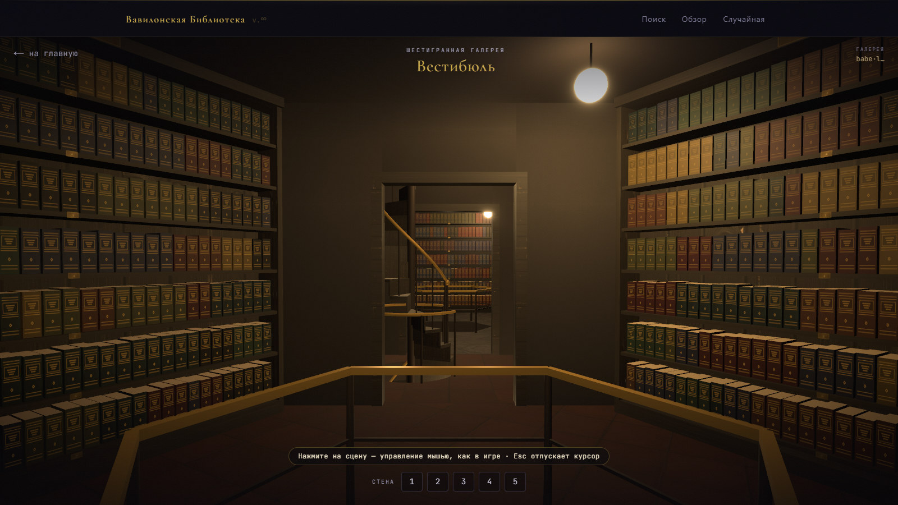
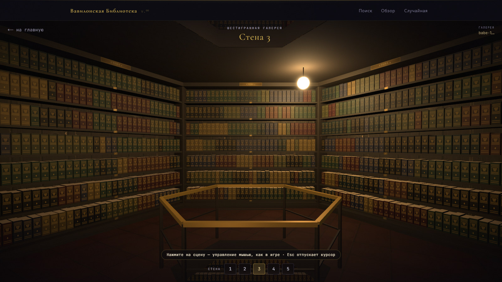
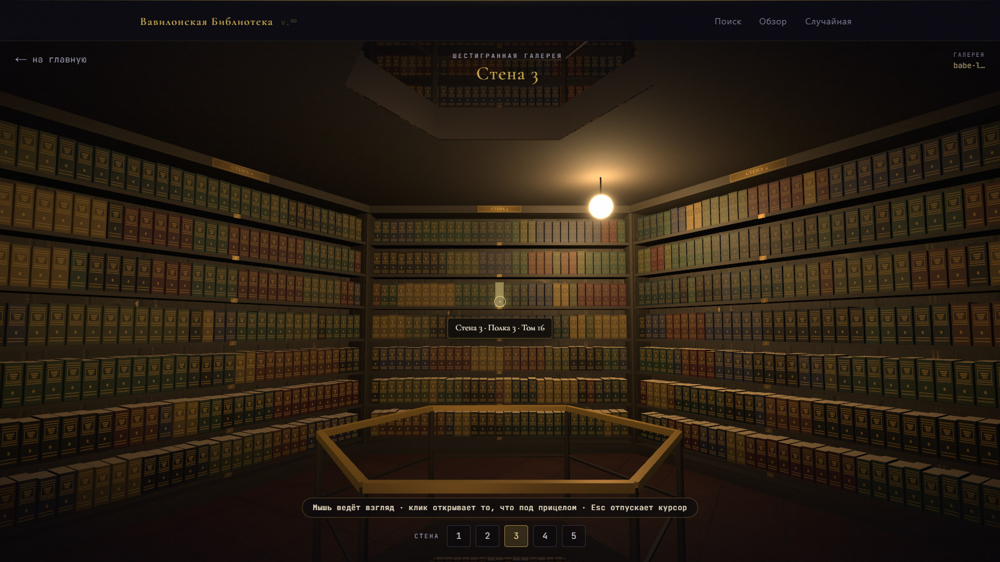
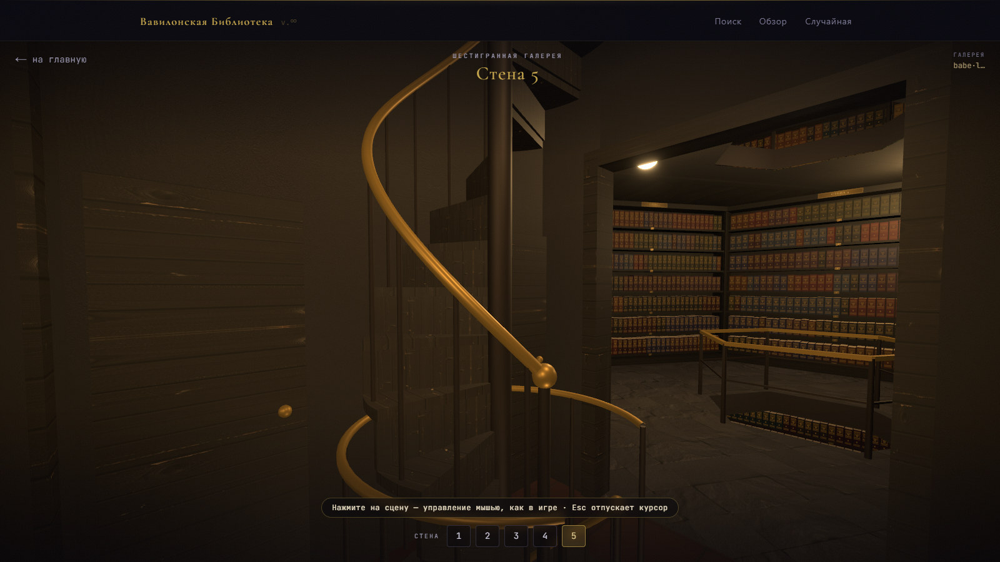
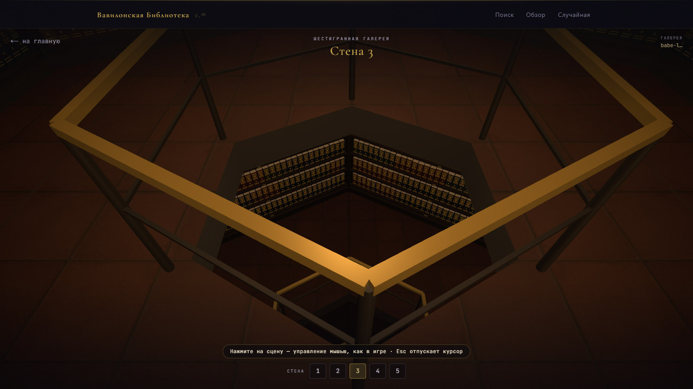
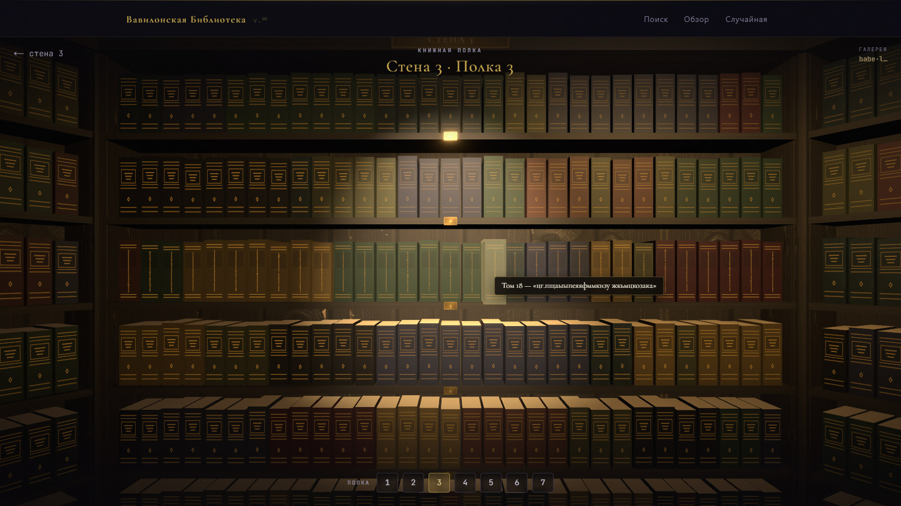
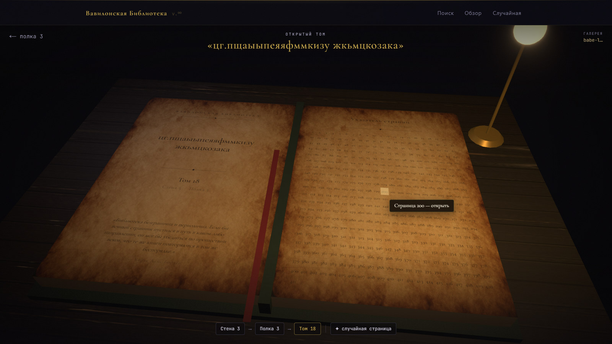
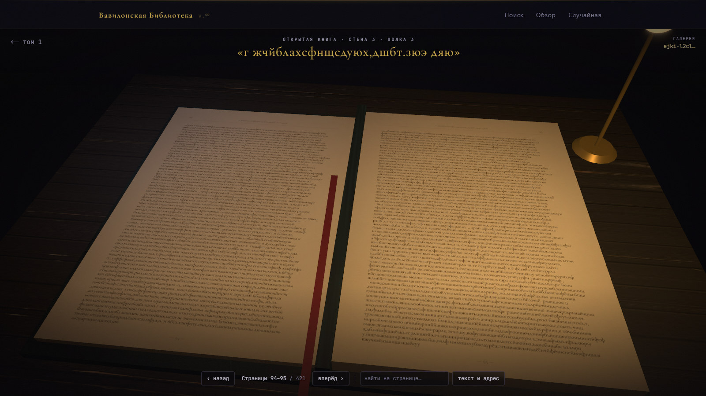
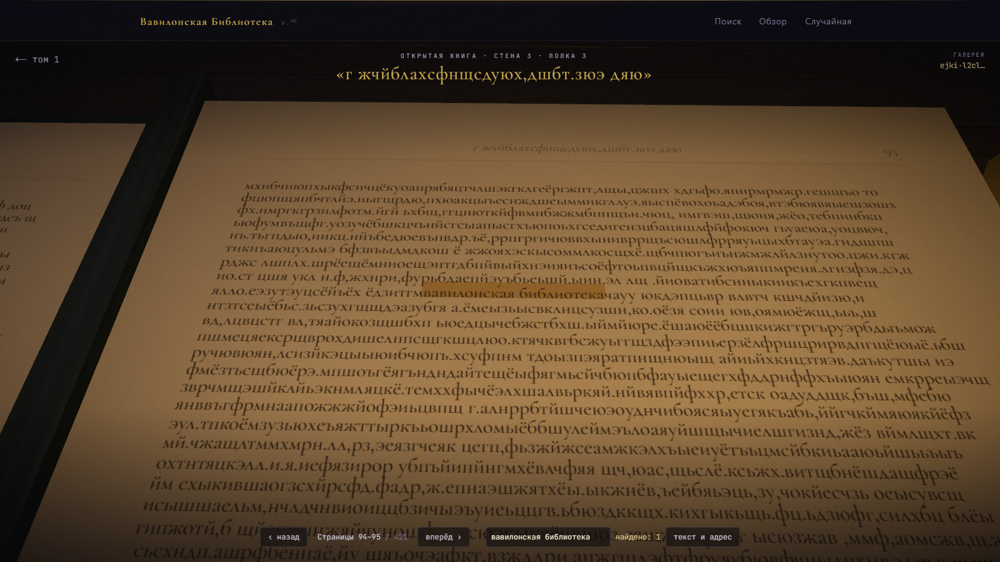
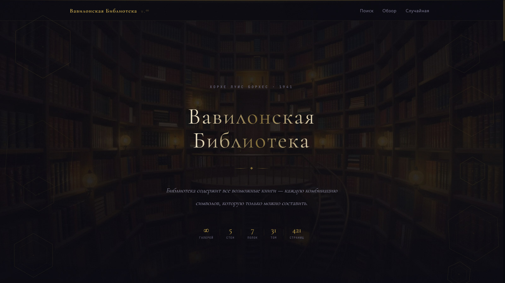

<p align="center">
  
  
  
  
</p>

<p align="center">
  <b>Русский</b> &nbsp;·&nbsp; <a href="README.en.md">English</a>
</p>

<h1 align="center">
  <br>
  Вавилонская Библиотека
  <br>
  <sub>La Biblioteca de Babel</sub>
</h1>

<p align="center">
  <em>
    &laquo;Вселенная &mdash; некоторые называют её Библиотекой &mdash; состоит из огромного,<br>
    возможно бесконечного числа шестигранных галерей.&raquo;
  </em>
  <br>
  <sub>&mdash; Хорхе Луис Борхес, 1941</sub>
</p>

<p align="center">
  
</p>

---

Цифровое воплощение легендарной Вавилонской библиотеки из одноимённого рассказа Борхеса. Библиотека содержит **все возможные книги** &mdash; каждую комбинацию символов, которую только можно составить. Каждая страница, которую вы когда-либо прочтёте или напишете, уже существует здесь. Каждое слово, каждая мысль, каждая история &mdash; записаны и ждут, когда их найдут.

И по этой библиотеке можно **пройтись**. Шестигранные галереи, винтовые лестницы, бесконечные полки &mdash; от первого лица, как в игре: снимите с полки любой том, раскройте его на столе и перелистайте страницы.

## Прогулка

Галереи не кончаются. За дверью &mdash; вестибюль с винтовой лестницей, за ним &mdash; следующая галерея, этажом выше и ниже &mdash; ещё галереи. Всё, что рядом, уже загружено и отрисовано, поэтому переход из одной галереи в другую ничем не выдаёт себя: мир просто продолжается.

<p align="center">
  
</p>

<table>
  <tr>
    <td width="50%">
      
      <br><sub><b>Шестигранная галерея.</b> Пять стен полок, лампа и перила вокруг шахты.</sub>
    </td>
    <td width="50%">
      
      <br><sub><b>Как в шутере.</b> Мышь ведёт взгляд, прицел выдвигает том, щелчок открывает его.</sub>
    </td>
  </tr>
  <tr>
    <td width="50%">
      
      <br><sub><b>Вестибюль.</b> Винтовая лестница ведёт на этажи выше и ниже, дверь &mdash; в соседнюю галерею.</sub>
    </td>
    <td width="50%">
      
      <br><sub><b>Шахта.</b> Под перилами видны галереи этажом ниже &mdash; и так без конца.</sub>
    </td>
  </tr>
</table>

## Книги

Каждая полка &mdash; 31 том с заглавием на корешке, каждый том &mdash; 421 страница. Раскрытую книгу можно читать как настоящую: листать, приближать, искать фразу на развороте.

<p align="center">
  
</p>

<table>
  <tr>
    <td width="50%">
      
      <br><sub><b>Полка крупным планом.</b> Открытая полка освещена, у каждого тома своё заглавие.</sub>
    </td>
    <td width="50%">
      
      <br><sub><b>Раскрытый том.</b> Титульный лист и указатель на все 421 страницу.</sub>
    </td>
  </tr>
  <tr>
    <td width="50%">
      
      <br><sub><b>Читальный стол.</b> Разворот при свете настольной лампы и красная закладка.</sub>
    </td>
    <td width="50%">
      
      <br><sub><b>Поиск на странице.</b> Фраза «вавилонская библиотека» нашлась на 95-й странице &mdash; камера сама подъезжает к ней.</sub>
    </td>
  </tr>
</table>

## Устройство библиотеки

Библиотека устроена так же, как описал её Борхес:

```
  галерея        стена        полка         том         страница
 ┌────────┐    ┌───────┐    ┌───────┐    ┌────────┐    ┌─────────┐
 │  адрес │ →  │ 1 — 5 │ →  │ 1 — 7 │ →  │ 1 — 31 │ →  │ 1 — 421 │
 └────────┘    └───────┘    └───────┘    └────────┘    └─────────┘

  каждая страница — 4 819 символов из 36-символьного алфавита:
  33 строчные русские буквы, пробел, запятая и точка
```

Адрес галереи &mdash; строка из цифр и латинских букв. Любой адрес ведёт в свою галерею, и в ней всегда стоят одни и те же книги. Галереи и полки на скриншотах выше &mdash; из галереи с адресом `babel`.

## Возможности

<p align="center">
  
</p>

**Поиск текста** &mdash; введите любой текст, и библиотека найдёт страницу, на которой он записан. Ваш текст уже существует &mdash; нужно лишь знать, где искать.

**Точный поиск** &mdash; найдите страницу, целиком заполненную вашим текстом, без посторонних символов.

**Поиск по заголовку** &mdash; каждый том имеет название. Найдите книгу по её заголовку.

**Обзор библиотеки** &mdash; выберите координаты вручную: стену, полку, том и страницу &mdash; и загляните в случайную книгу на пересечении этих координат.

**Случайная страница** &mdash; позвольте библиотеке самой выбрать для вас страницу из бесконечности.

**3D-прогулка** &mdash; бесконечный мир галерей от первого лица, полки с заглавиями, раскрытые тома и читалка с перелистыванием.

Поиск понимает только алфавит Библиотеки; всё остальное отбрасывается, а строка поиска заранее показывает, что именно будет искаться.

## Управление

| Где | Что сделать | Как |
|-----|-------------|-----|
| Галерея | взять мышь (прицел в центре) | щелчок по сцене |
| | отпустить курсор | `Esc` |
| | идти / бежать / прыгнуть | `W A S D` или стрелки / `Shift` / пробел |
| | приблизить | колесо мыши |
| | открыть полку или том | щелчок по тому, что под прицелом |
| Полка | открыть том | щелчок по корешку |
| Том | открыть страницу | щелчок по номеру в указателе |
| Читалка | листать | `←` `→`, `PageUp` `PageDown` или щелчок по странице |
| | найти на развороте | поле «найти на странице» |
| Телефон | осмотреться / идти | один палец / два пальца |

Где браузер разрешает захват курсора (pointer lock), используется он. Где нет &mdash; во встроенных панелях предпросмотра и песочницах &mdash; курсор прячется, взгляд ведёт свободная мышь, а у краёв экрана поворот продолжается сам.

## Запуск

```bash
npm install   # зависимости
npm run dev   # режим разработки
```

Откройте `http://localhost:3000` &mdash; или сразу галерею со скриншотов: `http://localhost:3000/explore/wall/1?hex=babel`.

```bash
npm run build && npm start   # продакшен-сборка
npm run lint                 # eslint (flat config)
npm run typecheck            # tsc --noEmit
```

## Как это устроено

- **Бесконечный мир.** Две галереи делят один вестибюль, пары повторяются по этажам, винтовая лестница делает один оборот на этаж. Соседние галереи (за дверью, выше и ниже) держатся в сцене со своими материалами, дальние этажи &mdash; облегчённые копии. Число источников света постоянно, поэтому шейдеры не перекомпилируются, когда вы идёте дальше.
- **Детерминированность.** Адреса соседних галерей выводятся из стартового, так что дорога назад ведёт к тем же книгам. Облик галереи &mdash; пол, стены, потолок, дерево полок, кожа и палитра переплётов &mdash; тоже выбирается из её адреса.
- **Текстуры** (`public/textures`) сгенерированы локально в ComfyUI моделью Z-Image Turbo.
- **Читалка** рисует страницы на canvas-текстурах, подсвечивает найденное и изгибает переворачиваемый лист прямо в вершинах геометрии.

## Стек

| Слой | Технология |
|------|------------|
| Фреймворк | **Next.js 16** (App Router, Turbopack) |
| Язык | **TypeScript 6** |
| UI | **Chakra UI v3** |
| Анимации | **Motion 13** (`motion/react`) |
| 3D | **three.js**, **@react-three/fiber**, **drei**, **postprocessing** |
| Шрифты | Cormorant Garamond, JetBrains Mono |

## Философия

> Когда было провозглашено, что Библиотека объемлет все книги, первым ощущением была безудержная радость. Все люди почувствовали себя обладателями нетронутого тайного сокровища. Не было проблемы &mdash; личной или мировой, &mdash; для которой не существовало бы красноречивого решения в какой-нибудь из шестигранных галерей.

Этот проект &mdash; попытка прикоснуться к бесконечности через конечный экран. Каждый адрес &mdash; это уникальная точка в пространстве всех возможных текстов. Библиотека не генерирует текст &mdash; она *находит* его. Страницы не создаются &mdash; они всегда существовали.

---

<p align="center">
  <sub>По мотивам рассказа Хорхе Луиса Борхеса &laquo;Вавилонская библиотека&raquo; (1941)</sub>
  <br>
  <sub>Создано <a href="https://github.com/HuHguZ">HuHguZ</a> &nbsp;·&nbsp; <a href="README.en.md">Read in English</a></sub>
</p>
