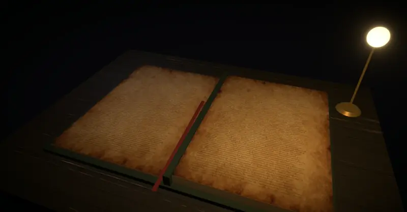
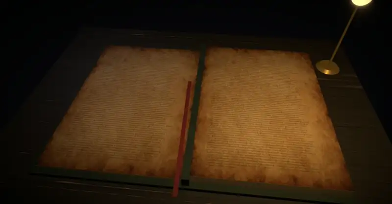

<p align="center">
  
  
  
  
  
</p>

<p align="center">
  <b>Русский</b> &nbsp;·&nbsp; <a href="README.en.md">English</a>
</p>

<h1 align="center">
  <br>
  Вавилонская Библиотека
  <br>
  <sub>La Biblioteca de Babel</sub>
</h1>

<p align="center">
  <em>
    &laquo;Вселенная &mdash; некоторые называют её Библиотекой &mdash; состоит из огромного,<br>
    возможно бесконечного числа шестигранных галерей.&raquo;
  </em>
  <br>
  <sub>&mdash; Хорхе Луис Борхес, 1941</sub>
</p>

<p align="center">
  
</p>

---

Цифровое воплощение легендарной Вавилонской библиотеки из одноимённого рассказа Борхеса. Библиотека содержит **все возможные книги** &mdash; каждую комбинацию символов, которую только можно составить. Каждая страница, которую вы когда-либо прочтёте или напишете, уже существует здесь. Каждое слово, каждая мысль, каждая история &mdash; записаны и ждут, когда их найдут.

И по этой библиотеке можно **пройтись**. Шестигранные галереи, винтовые лестницы, бесконечные полки &mdash; от первого лица, как в игре: снимите с полки любой том, раскройте его на столе и перелистайте страницы.

Библиотека говорит на **двух языках**: переключатель `RU | EN` в шапке сайта меняет не только интерфейс, но и саму Библиотеку &mdash; в английской версии книги написаны латиницей, и искать в ней можно английский текст.

## Прогулка

Галереи не кончаются. За дверью &mdash; вестибюль с винтовой лестницей, за ним &mdash; следующая галерея, этажом выше и ниже &mdash; ещё галереи. Всё, что рядом, уже загружено и отрисовано, поэтому переход из одной галереи в другую ничем не выдаёт себя: мир просто продолжается.

<p align="center">
  
</p>

<table>
  <tr>
    <td width="50%">
      
      <br><sub><b>Шестигранная галерея.</b> Пять стен полок, лампа и перила вокруг шахты.</sub>
    </td>
    <td width="50%">
      
      <br><sub><b>Как в шутере.</b> Мышь ведёт взгляд, прицел выдвигает том, щелчок открывает его.</sub>
    </td>
  </tr>
  <tr>
    <td width="50%">
      
      <br><sub><b>Вестибюль.</b> Винтовая лестница ведёт на этажи выше и ниже, дверь &mdash; в соседнюю галерею.</sub>
    </td>
    <td width="50%">
      
      <br><sub><b>Шахта.</b> Под перилами видны галереи этажом ниже &mdash; и так без конца.</sub>
    </td>
  </tr>
</table>

## Книги

Каждая полка &mdash; 31 том с заглавием на корешке, каждый том &mdash; 421 страница. Раскрытую книгу можно читать как настоящую: листать, склоняться над страницей и водить взглядом по строкам, искать фразу на развороте. Если листать быстро, страницы летят веером, по нескольку сразу, и ни один лист не переворачивается одинаково.

<p align="center">
  
</p>

<table>
  <tr>
    <td width="50%">
      
      <br><sub><b>Веером.</b> Листайте быстро &mdash; в воздухе окажется сразу несколько страниц.</sub>
    </td>
    <td width="50%">
      
      <br><sub><b>Над страницей.</b> Колесо подлетает к месту под курсором, а мышь и <code>W A S D</code> ведут взгляд по строкам.</sub>
    </td>
  </tr>
</table>

<table>
  <tr>
    <td width="50%">
      
      <br><sub><b>Полка крупным планом.</b> Открытая полка освещена, у каждого тома своё заглавие.</sub>
    </td>
    <td width="50%">
      
      <br><sub><b>Раскрытый том.</b> Титульный лист и указатель на все 421 страницу.</sub>
    </td>
  </tr>
  <tr>
    <td width="50%">
      
      <br><sub><b>Читальный стол.</b> Разворот при свете настольной лампы и красная закладка.</sub>
    </td>
    <td width="50%">
      
      <br><sub><b>Поиск на странице.</b> Фраза «вавилонская библиотека» нашлась на 87-й странице &mdash; камера сама подъезжает к ней.</sub>
    </td>
  </tr>
</table>

## Устройство библиотеки

Библиотека устроена так же, как описал её Борхес:

```
  галерея        стена        полка         том         страница
 ┌────────┐    ┌───────┐    ┌───────┐    ┌────────┐    ┌─────────┐
 │  адрес │ →  │ 1 — 5 │ →  │ 1 — 7 │ →  │ 1 — 31 │ →  │ 1 — 421 │
 └────────┘    └───────┘    └───────┘    └────────┘    └─────────┘

  каждая страница — 4 819 символов из 166-символьного алфавита:
  66 русских и 52 латинские буквы обоих регистров, 10 цифр,
  пробел, перенос строки и 36 знаков: весь печатный ASCII и — … « »
```

Различных страниц в русской Библиотеке &mdash; 166<sup>4819</sup> ≈ 5,0 × 10<sup>10698</sup>. У Борхеса алфавит был скромнее: 22 буквы, пробел, запятая и точка. В нашей Библиотеке есть всё, чем пишут ссылки, ключи и код, поэтому в ней можно найти и прокси-ключ, и функцию на JavaScript &mdash; с заглавными буквами, отступами и переносами строк.

Адрес галереи &mdash; строка из цифр и латинских букв обоих регистров (62 «цифры»). Любой адрес ведёт в свою галерею, и в ней всегда стоят одни и те же книги. Галереи и полки на скриншотах выше &mdash; из галереи с адресом `babel`.

## Два языка &mdash; две Библиотеки

<p align="center">
  
</p>

Переключатель `RU | EN` справа в шапке переводит весь сайт: меню, подсказки, надписи в 3D-сценах &mdash; таблички на стенах, титульный лист и указатель страниц в книге. Текущая страница, адрес галереи и фраза поиска при переключении сохраняются.

| | Русская Библиотека | Английская Библиотека |
|---|---|---|
| Адреса | `/`, `/page/…`, `/explore/…` | `/en`, `/en/page/…`, `/en/explore/…` |
| Буквы | 33 русские и 26 латинских, строчные и заглавные | 26 латинских, строчные и заглавные |
| Цифры, пробелы | 10, пробел и перенос строки | 10, пробел и перенос строки |
| Знаки | весь печатный ASCII и `— … « »` | весь печатный ASCII и `— …` |
| Символов всего | 166 | 98 |
| Различных страниц | 166<sup>4819</sup> ≈ 5,0 × 10<sup>10698</sup> | 98<sup>4819</sup> ≈ 5,2 × 10<sup>9595</sup> |

По одному и тому же адресу в двух Библиотеках лежат разные тексты, поэтому язык записан прямо в ссылке: ссылка на русскую страницу откроет русскую страницу даже у того, кто выбрал английский. Выбор запоминается и учитывается на главной, а при первом визите главная открывается на языке браузера.

## Возможности

**Поиск текста** &mdash; введите любой текст, и библиотека найдёт страницу, на которой он записан. Ваш текст уже существует &mdash; нужно лишь знать, где искать.

**Точный поиск** &mdash; найдите страницу, целиком заполненную вашим текстом, без посторонних символов.

**Поиск по заголовку** &mdash; каждый том имеет название. Найдите книгу по её заголовку.

**Обзор библиотеки** &mdash; выберите координаты вручную: стену, полку, том и страницу &mdash; и загляните в случайную книгу на пересечении этих координат.

**Случайная страница** &mdash; позвольте библиотеке самой выбрать для вас страницу из бесконечности.

**3D-прогулка** &mdash; бесконечный мир галерей от первого лица, полки с заглавиями, раскрытые тома и читалка с перелистыванием.

**Копирование и ссылка на фрагмент** &mdash; панель «текст и адрес» рядом с раскрытой книгой показывает текст разворота: страницу целиком можно скопировать одной кнопкой, а несколько строк &mdash; выделить и скопировать ссылку на них. Ссылка откроет тот же разворот с уже открытой панелью и отмеченным фрагментом &mdash; и в тексте, и на странице 3D-книги, а камера сама подлетит к нему. Пока вы выделяете текст, книга отмечает те же знаки. Цвет отметки можно сменить: квадратик рядом со словом «фрагмент» открывает палитру с готовыми цветами, а выбор запоминается в браузере.

Поле поиска многострочное: `Enter` ищет, `Shift+Enter` начинает новую строку, а вставить можно хоть стихотворение, хоть кусок кода. Регистр, пробелы и переносы строк сохраняются как есть, табуляция становится четырьмя пробелами, типографские варианты знаков приводятся к алфавиту (`“ ”` → `"`, `–` → `—`), а символы, которых в Библиотеке нет (например, эмодзи), отбрасываются. Строка поиска заранее показывает, что именно будет искаться.

Библиотека &mdash; не сейф: адрес страницы &mdash; это её текст, записанный обратимо по открытому алгоритму. Кто получил ссылку, тот прочитает и ключ, который на ней лежит.

## Управление

| Где | Что сделать | Как |
|-----|-------------|-----|
| Поиск на главной | искать / новая строка в запросе | `Enter` / `Shift+Enter` |
| Галерея | взять мышь (прицел в центре) | щелчок по сцене |
| | отпустить курсор | `Esc` |
| | идти / бежать / прыгнуть | `W A S D` или стрелки / `Shift` / пробел |
| | приблизить | колесо мыши |
| | открыть полку или том | щелчок по тому, что под прицелом |
| Полка | открыть том | щелчок по корешку |
| Том | открыть страницу | щелчок по номеру в указателе |
| Читалка | листать | `←` `→`, `PageUp` `PageDown` или щелчок по странице |
| | вести взгляд над книгой | перетаскивание мышью или `W A S D` (`Shift` быстрее) |
| | подлететь к месту на странице | колесо мыши к курсору, `↑` `↓` ближе и дальше |
| | наклонить книгу / вся книга | правая кнопка мыши / `Home` |
| | найти на развороте | поле «найти на странице» |
| | к следующему / предыдущему совпадению | `Enter` / `Shift+Enter` или стрелки `↓` `↑` рядом со счётчиком |
| | скопировать страницу / поделиться фрагментом | «текст и адрес», затем «копировать текст» / выделить текст и «ссылка на фрагмент» |
| | сменить цвет выделения | квадратик цвета в строке фрагмента |
| Телефон | осмотреться / идти | один палец / два пальца |
| | в читалке: вести взгляд / приблизить и наклонить | один палец / два пальца |
| Везде | сменить язык | переключатель `RU \| EN` в шапке |

Где браузер разрешает захват курсора (pointer lock), используется он. Где нет &mdash; во встроенных панелях предпросмотра и песочницах &mdash; курсор прячется, взгляд ведёт свободная мышь, а у краёв экрана поворот продолжается сам.

## Запуск

```bash
npm install   # зависимости
npm run dev   # режим разработки
```

Откройте `http://localhost:3000` &mdash; или сразу галерею со скриншотов: `http://localhost:3000/explore/wall/1?hex=babel` (по-английски &mdash; `http://localhost:3000/en/explore/wall/1?hex=babel`).

```bash
npm run build && npm start   # продакшен-сборка
npm run lint                 # eslint (flat config)
npm run typecheck            # tsc --noEmit
npm test                     # тесты (Vitest)
```

## Как это устроено

- **Бесконечный мир.** Две галереи делят один вестибюль, пары повторяются по этажам, винтовая лестница делает один оборот на этаж. Соседние галереи (за дверью, выше и ниже) держатся в сцене со своими материалами, дальние этажи &mdash; облегчённые копии. Число источников света постоянно, поэтому шейдеры не перекомпилируются, когда вы идёте дальше.
- **Детерминированность.** Адреса соседних галерей выводятся из стартового, так что дорога назад ведёт к тем же книгам. Облик галереи &mdash; пол, стены, потолок, дерево полок, кожа и палитра переплётов &mdash; тоже выбирается из её адреса.
- **Обратимый алгоритм.** Каждый символ страницы сдвигается на псевдослучайную величину из ключевого потока, который зависит от стены, полки, тома и страницы, а сдвинутые символы записываются «цифрами» адреса блоками: 4 символа русской Библиотеки &mdash; 5 цифр, 7 символов английской &mdash; 8 цифр. Блок читается как одно число, поэтому адрес страницы занимает не больше 6 024 знаков, всего на 1% длиннее теоретического минимума для 62 цифр. Поиск записывает текст в адрес, чтение возвращает его обратно (`src/lib/babel.ts`, упаковка &mdash; `src/lib/library.ts`, алфавиты &mdash; `src/lib/alphabet.ts`).
- **Длинные ссылки.** Адрес и фраза поиска `q` вместе могут занимать десятки килобайт, а Node по умолчанию отклоняет запросы с заголовками больше 16 КБ (ошибка 431). `.npmrc` поднимает этот предел для `npm run dev` и `npm start`.
- **Переносы строк на 3D-странице.** Строка обрывается там, где в тексте перенос, и переносится после 80 знаков. Если строк получается больше 61, шрифт мельчает, а строки удлиняются ровно настолько, чтобы весь текст поместился на лист (`layoutPage` в `src/components/explore/bookPages.ts`).
- **Интернационализация** на [next-intl](https://next-intl.dev): переводы в `messages/ru.json` и `messages/en.json`, маршруты под сегментом `[locale]`, русский &mdash; без префикса. `src/proxy.ts` определяет язык только для главной; остальные ссылки никогда не перенаправляются на другой язык.
- **Текстуры** (`public/textures`) сгенерированы локально в ComfyUI моделью Z-Image Turbo.
- **Читалка** рисует страницы на canvas-текстурах заранее, на несколько разворотов вперёд и назад, и сразу загружает их в видеопамять, поэтому у перевёрнутого листа уже есть текст на обороте. Каждый лист движется сам по себе (`src/components/explore/leaves.ts`): следующий поднимается, когда предыдущий чуть ушёл вперёд, а длинная очередь листается пачкой. Изгиб считается в вершинах геометрии как пружина: у каждого переворота свой случайный характер (скорость, жёсткость, какой угол ведёт, рябь по кромке).
- **Ссылки на фрагменты** выглядят как `/page/<адрес>?text=12:160-240`: номер страницы и смещения знаков в её тексте из 4 819 символов (конец не включается), рядом с фразой поиска `q`, если она есть. Выделение в панели переводится в эти смещения так: измеряется длина текста от начала страницы до каждого конца выделения, поэтому подсветка поиска, дробящая текст на куски, не мешает (`src/lib/fragment.ts`).

## Стек

| Слой | Технология |
|------|------------|
| Фреймворк | **Next.js 16** (App Router, Turbopack) |
| Язык | **TypeScript 6** |
| UI | **Chakra UI v3** |
| Анимации | **Motion 13** (`motion/react`) |
| 3D | **three.js**, **@react-three/fiber**, **drei**, **postprocessing** |
| Переводы | **next-intl 4** |
| Шрифты | Cormorant Garamond, JetBrains Mono |

## Философия

> Когда было провозглашено, что Библиотека объемлет все книги, первым ощущением была безудержная радость. Все люди почувствовали себя обладателями нетронутого тайного сокровища. Не было проблемы &mdash; личной или мировой, &mdash; для которой не существовало бы красноречивого решения в какой-нибудь из шестигранных галерей.

Этот проект &mdash; попытка прикоснуться к бесконечности через конечный экран. Каждый адрес &mdash; это уникальная точка в пространстве всех возможных текстов. Библиотека не генерирует текст &mdash; она *находит* его. Страницы не создаются &mdash; они всегда существовали.

---

<p align="center">
  <sub>По мотивам рассказа Хорхе Луиса Борхеса &laquo;Вавилонская библиотека&raquo; (1941)</sub>
  <br>
  <sub>Создано <a href="https://github.com/HuHguZ">HuHguZ</a> &nbsp;·&nbsp; <a href="README.en.md">Read in English</a></sub>
</p>
